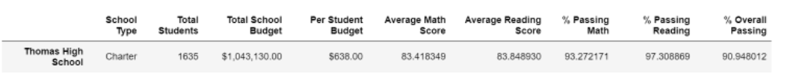
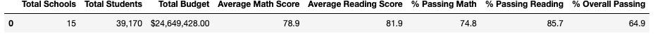
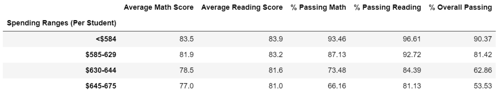
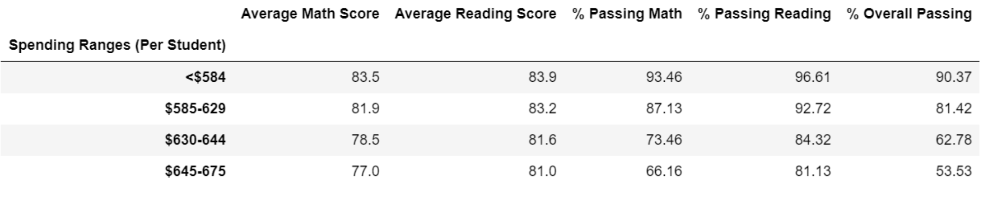
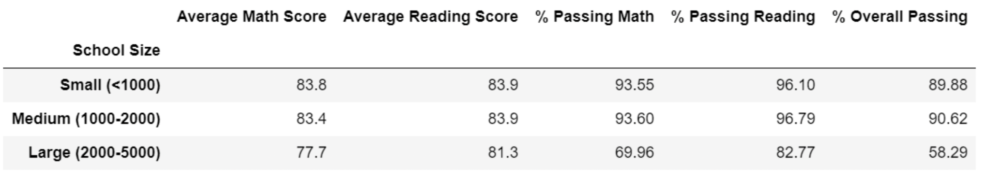
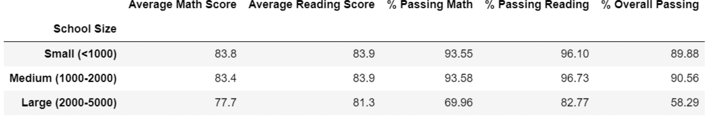
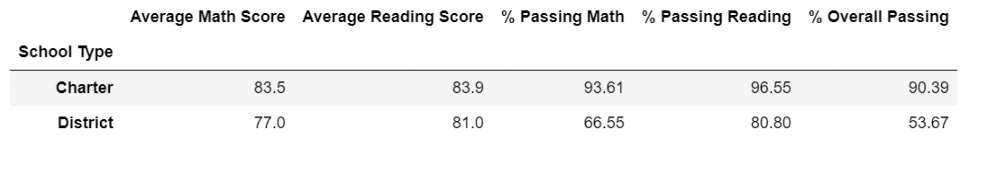

# School_District_Analysis

## Overview of Project
A school district asked for a snapshot of several key metrics by each school campus and by the district level. The main analysis focused on the performance of math and reading scores disaggregated several ways in preparation for a board meeting. However, after the school board reviewed the data, it was determined that the data from Thomas High School's 9th grade class was suspect of cheating. The school board asked for the data to be removed and analyzed again for a comparison.

# Analysis

### How is the distric summary affected?
When comparing the original analysis with the summary post removing the Thomas High 9th graders there was not much of a difference. The total number of students remained the same do to the grades of the Thomas High students were the only things dropped. The student count and budget remained the same. When looking at the grades after removing the student, the scores dropped about 1% whhich isnt a big difference since the rounded number will still be the same.

### Original Summary:

### Adjusted Summary:

### How is the school summary affected?

In the original analysis, Thomas High School started with a 91% overall passing rate. This was concerning to the Board therefore after removing the 9th graders and recalculating,the rest of the testing data was adjusted accordingly. The results showed that the Thomas High School **Passing Math %, Passing Reading % and Overall %** dropped drastically. The average went from about 91% to 65%.

Orginal Analysis:

Adjusted Analysis:

### How does replacing the ninth graders’ math and reading scores affect Thomas High School’s performance relative to the other schools?

### How does replacing the ninth-grade scores affect the following:
## Math and reading scores by grade
Replacing the 9th grade math and readig scores did not have a direct impact on the other grade levels grades

## Scores by school spending
There was little to no impacted on the spending ranges after removing the 9th grade scores. Thomas HS falls within the $630- $644 per student range.

Original Analysis:

Adjusted Analysis:

## Scores by school size
There was little to no impacted on the school size range after removing the 9th grade scores. Thomas HS falls within the range to be classified as a medium sized school.

Original Analysis:

Adjusted Analysis:

## Scores by school type
There was little to no impacted by school type after removing the 9th grade scores. Thomas HS is a Charter School.

Original Analysis:

Adjusted Analysis:

